<div align="center">

# 🗣️ Sign2Sound

### *Bridging the gap between Sign Language and Spoken English with Real-Time, Edge-Computed AI*

[](https://pytorch.org/)
[](https://mediapipe.dev/)
[](https://huggingface.co/Qwen)
[](https://github.com/hexgrad/kokoro)
[](LICENSE)

```
┌─────────────────────────────────────────────────────────────┐
│  👋 Sign Language  →  🧠 AI Processing  →  🔊 Natural Speech │
│                    Fully Offline & Private                   │
└─────────────────────────────────────────────────────────────┘
```

[Features](#-key-innovations) • [Architecture](#️-system-architecture) • [Installation](#-installation) • [Usage](#-usage) • [Team](#-team)

</div>

---

## 📖 Overview

**Sign2Sound** is a cutting-edge, real-time sign language translation system designed to run **entirely on consumer-grade hardware** with **zero cloud dependency**. 

🎯 **Mission**: Empower deaf and hard-of-hearing individuals with accessible, privacy-first communication technology.

### 🌟 What Makes Us Different?

<table>
<tr>
<td width="33%" align="center">
<h3>🔒 Privacy First</h3>
<b>100% Offline</b><br/>
Zero data leaves your device
</td>
<td width="33%" align="center">
<h3>⚡ Edge-Optimized</h3>
<b>20+ FPS</b><br/>
Real-time on consumer laptops
</td>
<td width="33%" align="center">
<h3>🧠 AI-Powered</h3>
<b>Qwen2.5 + KokoroTTS</b><br/>
Natural language & voice
</td>
</tr>
</table>

---

## 🚀 Key Innovations

<div align="center">

| Innovation | Description | Impact |
|:----------:|:------------|:------:|
| 🎯 **Temporal Intelligence** | LSTM/Transformer models capture motion dynamics & sign boundaries | 🔥 High Accuracy |
| 🚄 **Edge Computing** | Optimized for resource-constrained devices | ⚡ Real-time |
| 🦴 **Landmark-Based** | MediaPipe skeletal extraction (interpretable & lightweight) | 📊 Explainable AI |
| 🤖 **Qwen2.5 Grammar** | Small Language Model corrects glosses to natural English | 💬 Natural Output |
| 🔊 **KokoroTTS Voice** | High-fidelity, low-latency speech synthesis | 🎵 Human-like |
| 🔐 **Privacy-Centric** | No cloud APIs, no data collection | 🛡️ Secure |

</div>

---

## 🛠️ System Architecture

```mermaid
graph LR
    A[📹 Video Input] --> B[🦴 MediaPipe<br/>Skeletal Extraction]
    B --> C[⚙️ Temporal Feature<br/>Engineering]
    C --> D[🧠 LSTM/Transformer<br/>Sign Classification]
    D --> E[🤖 Qwen2.5 LLM<br/>Grammar Correction]
    E --> F[🔊 KokoroTTS<br/>Speech Synthesis]
    F --> G[🎵 Natural Speech Output]
    
    style A fill:#3498db,stroke:#2980b9,color:#fff
    style B fill:#e74c3c,stroke:#c0392b,color:#fff
    style C fill:#f39c12,stroke:#d68910,color:#fff
    style D fill:#9b59b6,stroke:#8e44ad,color:#fff
    style E fill:#FF6B6B,stroke:#e74c3c,color:#fff
    style F fill:#9B59B6,stroke:#8e44ad,color:#fff
    style G fill:#2ecc71,stroke:#27ae60,color:#fff
```

<div align="center">



</div>

### 🔍 Pipeline Stages

<details>
<summary><b>1️⃣ Skeletal Extraction (MediaPipe Holistic)</b></summary>

- **Tool**: Google MediaPipe Holistic
- **Data**: Extracts hand landmarks (21 keypoints/hand) and pose landmarks (33 keypoints)
- **Normalization**: Wrist-relative or shoulder-relative alignment for pose invariance
- **Output**: 126-dimensional feature vectors per frame

</details>

<details>
<summary><b>2️⃣ Temporal Feature Engineering</b></summary>

- **Sequences**: Sliding window approach to capture temporal context
- **Features**: Velocity, acceleration, and spatial relationships between landmarks
- **Augmentation**: Temporal jitter, spatial rotation, and scaling for robustness
- **Buffer**: Dynamic sequence buffering for variable-length signs

</details>

<details>
<summary><b>3️⃣ Sign Classification (Temporal Model)</b></summary>

- **Architecture**: Bidirectional LSTM or lightweight Transformer encoder
- **Input**: Normalized landmark sequences (126-dimensional vectors per frame)
- **Output**: Raw glosses (e.g., "WHO EAT NOW")
- **Optimization**: Quantized for edge deployment (< 10MB)

</details>

<details>
<summary><b>4️⃣ Grammar Correction (Qwen2.5 LLM) 🤖</b></summary>

> **🌟 Powered by Qwen2.5 Small Language Model**

- **Model**: Quantized Qwen2.5-1.5B-Instruct (4-bit GPTQ)
- **Task**: Convert raw sign glosses into grammatically correct English
- **Example**: 
  - Input: `"WHO EAT NOW"`
  - Output: `"Who is eating now?"`
- **Latency**: < 200ms on CPU
- **Context-Aware**: Understands sign language grammar patterns

</details>

<details>
<summary><b>5️⃣ Speech Synthesis (KokoroTTS) 🔊</b></summary>

> **🎵 Powered by KokoroTTS - High-Fidelity Neural TTS**

- **Engine**: KokoroTTS (Lightweight, Expressive Neural TTS)
- **Quality**: Natural, human-like voice with emotional intonation
- **Latency**: < 80ms for real-time synthesis
- **Offline**: Fully local execution, no API calls
- **Voices**: Multiple voice profiles available

</details>

---

## 📊 Performance Metrics

<div align="center">

### 🎯 Benchmark Results

| Metric | Value | Hardware | Notes |
|:------:|:-----:|:--------:|:------|
| **🎯 Accuracy** | **85-90%** | Consumer Laptop | On operational sign set (30-50 signs) |
| **⚡ Latency** | **< 100ms** | CPU (Intel i5) | Per sign inference |
| **🎬 FPS** | **20-25** | Webcam 720p | Real-time processing |
| **💾 Model Size** | **< 10MB** | Compressed | LSTM/Transformer model |
| **🤖 Grammar Latency** | **< 200ms** | CPU | Qwen2.5 correction |
| **🔊 TTS Latency** | **< 80ms** | CPU | KokoroTTS synthesis |

### 📈 End-to-End Pipeline

```
┌──────────────┬──────────────┬──────────────┬──────────────┐
│ Video Input  │ Sign Detect  │ Grammar Fix  │ Voice Output │
│   (Real-time)│   (~100ms)   │   (~200ms)   │   (~80ms)    │
│              │              │              │              │
│      👋      │      🧠      │      🤖      │      🔊      │
└──────────────┴──────────────┴──────────────┴──────────────┘
         Total Latency: ~380ms (Perceived as Real-time)
```

</div>

**Note**: Confusion matrices and training curves are available in the `results/` directory.

---

## 📦 Installation

### 🔧 Prerequisites

```bash
✅ Python 3.8+
✅ Webcam (for live inference) or video files
✅ NVIDIA GPU (optional, for faster training)
✅ 4GB RAM minimum (8GB recommended)
```

### 🚀 Quick Start

```bash
# 1️⃣ Clone the repository
git clone https://github.com/Atul013/SIGN2SOUND_ABH.git
cd SIGN2SOUND_ABH

# 2️⃣ Install dependencies
pip install -r requirements.txt

# 3️⃣ Download pre-trained models (if available)
# Place model weights in checkpoints/
# - best_model.pth (Sign classifier)
# - qwen2.5-1.5b-instruct-gptq (Grammar model)
# - kokoro-v0.19.pth (TTS model)
```

### 🎨 Optional: Install Advanced Features

```bash
# For Qwen2.5 LLM support
pip install transformers accelerate bitsandbytes

# For KokoroTTS support
pip install kokoro-onnx phonemizer
```

---

## 💻 Usage

### 🎬 Demo Modes

<table>
<tr>
<td width="50%">

#### 🔴 Real-time Webcam Demo

```bash
python inference/realtime_demo.py \
  --model checkpoints/best_model.pth \
  --use-grammar \
  --use-tts
```

**Features**:
- ✅ Live sign detection
- ✅ Qwen2.5 grammar correction
- ✅ KokoroTTS voice output
- ✅ Visual feedback overlay

</td>
<td width="50%">

#### 📹 Video File Processing

```bash
python inference/infer.py \
  --input data/test_video.mp4 \
  --model checkpoints/best_model.pth \
  --output results/output.txt
```

**Features**:
- ✅ Batch processing
- ✅ Frame-by-frame analysis
- ✅ Export to text/JSON
- ✅ Performance metrics

</td>
</tr>
</table>

### 🛠️ Training Pipeline

```bash
# 1️⃣ Preprocess raw videos
python preprocessing/preprocess.py \
  --input data/raw_videos \
  --output data/landmarks

# 2️⃣ Train the temporal model
python training/train.py \
  --config training/config.yaml \
  --epochs 50 \
  --batch-size 32

# 3️⃣ Evaluate on test set
python training/evaluate.py \
  --model checkpoints/best_model.pth \
  --test-data data/test_set
```

---

## 📂 Dataset Information

<div align="center">

### 📚 Primary Data Sources

| Dataset | Type | Signs/Classes | Size | Usage |
|:--------|:-----|:-------------:|:----:|:------|
| �� **ASL Alphabet (Kaggle)** | Image Dataset | **29 classes** | **~87,000 images** | **Primary Training** |
| �� **ISL Skeletal** | Pre-extracted landmarks | 50+ | Medium | Validation |
| 🇮🇳 **Malayalam SL** | Regional signs | 20+ | Small | Diversity testing |

</div>

---

### 🌟 Featured Dataset: ASL Alphabet (Kaggle)

<div align="center">

**📦 [Download from Kaggle →](https://www.kaggle.com/datasets/debashishsau/aslamerican-sign-language-aplhabet-dataset)**

[](https://www.kaggle.com/datasets/debashishsau/aslamerican-sign-language-aplhabet-dataset)
[](https://creativecommons.org/publicdomain/zero/1.0/)
[](https://www.kaggle.com/datasets/debashishsau/aslamerican-sign-language-aplhabet-dataset)

</div>

#### 📊 Dataset Specifications

<table>
<tr>
<td width="50%">

**📁 Content Structure**
- ✅ **29 Classes Total**
  - 26 Alphabets (A-Z)
  - 3 Special Classes (SPACE, DELETE, NOTHING)
- ✅ **~87,000 Training Images**
- ✅ **29 Test Images** (encourages real-world testing)
- ✅ **Organized Folder Structure**

</td>
<td width="50%">

**🎯 Key Features**
- ✅ **High-Quality Images**: Clear hand gestures
- ✅ **Diverse Backgrounds**: Various lighting conditions
- ✅ **Multiple Angles**: Different hand orientations
- ✅ **CC0 License**: Public domain, free to use
- ✅ **Ready for Classification**: Pre-labeled and organized

</td>
</tr>
</table>

#### 💡 Why This Dataset?

> **Bridging Communication Gaps**: This dataset was created specifically to reduce the communication barrier between sign language users and non-sign language users. It's perfect for training robust ASL alphabet recognition models!

**Dataset Stats**:
```
📦 Total Size:      ~4.5 GB (compressed)
📸 Image Format:    JPG/PNG
🎯 Classes:         29 (A-Z + SPACE + DELETE + NOTHING)
👥 Contributors:    Open-source community
⭐ Popularity:      52K+ views, 10.7K+ downloads, 83 upvotes
```

#### 🚀 Quick Start with This Dataset

```bash
# 1️⃣ Download from Kaggle
# Visit: https://www.kaggle.com/datasets/debashishsau/aslamerican-sign-language-aplhabet-dataset
# Or use Kaggle API:
kaggle datasets download -d debashishsau/aslamerican-sign-language-aplhabet-dataset

# 2️⃣ Extract the dataset
unzip aslamerican-sign-language-aplhabet-dataset.zip -d data/raw/

# 3️⃣ Preprocess for training
python preprocessing/preprocess.py \
  --input data/raw/asl_alphabet_train \
  --output data/processed/landmarks \
  --extract-landmarks
```

---

### 📋 Operational Sign Set

Our current implementation focuses on a **validation subset** across multiple categories:

<div align="center">

| Category | Examples | Count | Temporal Complexity |
|:--------:|:---------|:-----:|:-------------------:|
| 🔤 **Alphabet** | A-Z fingerspelling | 26 | Static/Low |
| 👋 **Greetings** | Hello, Thank You, Sorry | 5-10 | Medium |
| 🍽️ **Needs** | Help, Water, Food | 5-10 | Medium-High |
| ✅ **Responses** | Yes, No, Maybe | 3-5 | Low-Medium |
| 🔢 **Numbers** | 0-10 | 11 | Low |

**Total Operational Signs**: 30-50 signs (expandable to 100+ in Phase 3)

</div>

### 📊 Data Splits

```
┌─────────────────────────────────────────────────────────┐
│                    Data Distribution                     │
├─────────────────────────────────────────────────────────┤
│                                                          │
│  📊 Training:   70% (Augmented with temporal jitter)    │
│     └─ Techniques: Rotation, scaling, temporal shifts   │
│                                                          │
│  📊 Validation: 15% (Hyperparameter tuning)             │
│     └─ Used for early stopping and model selection      │
│                                                          │
│  📊 Test:       15% (Held-out, person-independent)      │
│     └─ Final evaluation, never seen during training     │
│                                                          │
└─────────────────────────────────────────────────────────┘
```

**Note**: Splits are stratified by participant (when metadata is available) to ensure person-independent evaluation and prevent overfitting.


---

## 🔮 Future Roadmap

<div align="center">

```
┌─────────────────────────────────────────────────────────┐
│                    🚀 Development Phases                 │
├─────────────────────────────────────────────────────────┤
│                                                          │
│  ✅ Phase 1: Core Pipeline (COMPLETED)                  │
│     └─ MediaPipe + LSTM + Basic TTS                     │
│                                                          │
│  🔄 Phase 2: Intelligence Upgrade (IN PROGRESS)         │
│     ├─ ✅ Qwen2.5 Grammar Correction                    │
│     ├─ ✅ KokoroTTS Integration                         │
│     └─ 🔄 Expand to 100+ signs                          │
│                                                          │
│  📋 Phase 3: Production Ready (PLANNED)                 │
│     ├─ Mobile deployment (TFLite/ONNX)                  │
│     ├─ Hardware integration (depth cameras)             │
│     ├─ Multi-language support                           │
│     └─ Streaming real-time decoder                      │
│                                                          │
└─────────────────────────────────────────────────────────┘
```

</div>

### 🎯 Upcoming Features

- [ ] **🌍 Multi-Language**: Support for ISL, ASL, BSL, and regional variants
- [ ] **📱 Mobile App**: Android/iOS deployment with on-device inference
- [ ] **🎥 Depth Sensing**: Intel RealSense integration for 3D hand tracking
- [ ] **🔄 Streaming Mode**: Asynchronous token decoding for lower latency
- [ ] **🎨 Custom Voices**: Train personalized KokoroTTS voice profiles
- [ ] **📊 Analytics Dashboard**: Real-time performance monitoring

---

## 👥 Team

<div align="center">

<table>
<tr>
<td align="center" width="33%">
<br/>
<b>Zayed Bin Hassan</b><br/>
<sub>AI Engineer & Architecture</sub><br/>
<a href="https://github.com/zayed">GitHub</a>
</td>
<td align="center" width="33%">
<br/>
<b>Amal Babu</b><br/>
<sub>Data Processing & Model Training</sub><br/>
<a href="https://github.com/amal">GitHub</a>
</td>
<td align="center" width="33%">
<br/>
<b>Atul Biju</b><br/>
<sub>Feature Engineering & Deployment</sub><br/>
<a href="https://github.com/Atul013">GitHub</a>
</td>
</tr>
</table>

</div>

---

## 🏆 Key Technologies

<div align="center">

### 🧠 AI/ML Stack

[](https://pytorch.org/)
[](https://mediapipe.dev/)
[](https://huggingface.co/transformers)
[](https://numpy.org/)
[](https://opencv.org/)

### 🎯 Specialized Models

<table>
<tr>
<td align="center" width="50%">
<h3>🤖 Qwen2.5-1.5B-Instruct</h3>
<b>Grammar Correction Engine</b><br/><br/>
✅ 4-bit GPTQ Quantization<br/>
✅ Context-aware gloss correction<br/>
✅ < 200ms latency on CPU<br/>
✅ Fully offline execution<br/><br/>
<a href="https://huggingface.co/Qwen/Qwen2.5-1.5B-Instruct">Model Card →</a>
</td>
<td align="center" width="50%">
<h3>🔊 KokoroTTS v0.19</h3>
<b>Neural Speech Synthesis</b><br/><br/>
✅ High-fidelity, expressive voices<br/>
✅ < 80ms synthesis latency<br/>
✅ Multiple voice profiles<br/>
✅ Emotional intonation support<br/><br/>
<a href="https://github.com/hexgrad/kokoro">GitHub Repo →</a>
</td>
</tr>
</table>

</div>

---

## 📜 License

<div align="center">

Distributed under the **MIT License**. See [`LICENSE`](LICENSE) for more information.

```
MIT License - Free to use, modify, and distribute
```

</div>

---

## 🙏 Acknowledgments

<div align="center">

Special thanks to the open-source community and these amazing projects:

🙌 **[MediaPipe](https://mediapipe.dev/)** by Google - Landmark extraction framework  
🙌 **[Qwen Team](https://huggingface.co/Qwen)** - Small Language Model for grammar correction  
🙌 **[KokoroTTS](https://github.com/hexgrad/kokoro)** - High-fidelity neural TTS engine  
🙌 **[PyTorch](https://pytorch.org/)** - Deep learning framework  
🙌 **Competition Organizers** - Dataset provision and guidelines  

</div>

---

<div align="center">

### 🌟 Star this repo if you find it useful!

**Sign2Sound** – *Empowering accessible communication through AI* 🚀

[](https://github.com/Atul013/SIGN2SOUND_ABH)
[](https://github.com/Atul013/SIGN2SOUND_ABH/fork)

---

Made with ❤️ by Team ABH

</div>
